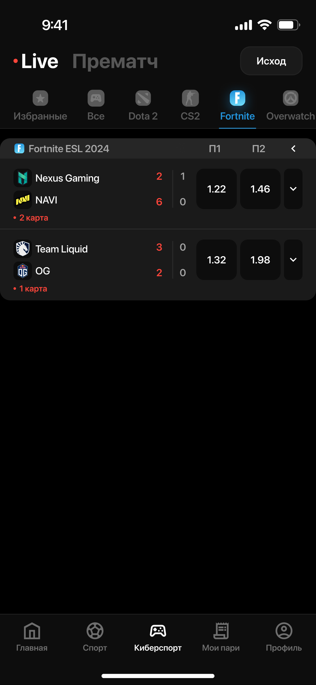

# Phone Showcase Component - Шаблон

Готовый блок для отображения мокапа телефона с контентом внутри. Плавно масштабируется без резких скачков.

## HTML структура

```html
<section class="phone-showcase">
    <div class="phone-showcase__container">
        <div class="phone-showcase__mockup">
            <div class="phone-showcase__frame">
                
                <div class="phone-showcase__content">
                    
                    <!-- Или для видео: -->
                    <!-- <video src="assets/contentVideo.mp4" class="phone-showcase__content-img" autoplay muted loop playsinline></video> -->
                </div>
            </div>
        </div>
    </div>
</section>
```

## CSS (уже включен в styles.css)

Компонент использует следующие классы:
- `.phone-showcase` - внешний контейнер с фоном и обводкой
- `.phone-showcase__container` - контейнер для центрирования
- `.phone-showcase__mockup` - контейнер мокапа
- `.phone-showcase__frame` - обертка изображения телефона
- `.phone-showcase__frame-img` - изображение мокапа телефона
- `.phone-showcase__content` - контейнер контента (позиционируется абсолютно)
- `.phone-showcase__content-img` - изображение/видео контента

## Особенности

- **Плавное масштабирование**: Использует viewport units (vw) для естественного масштабирования
- **Адаптивность**: Автоматически подстраивается под ширину экрана
- **Z-index**: Мокап (z-index: 2) находится поверх контента (z-index: 1)
- **Позиционирование**: Контент центрируется через transform: translate(-50%, -50%)

## Использование

1. Скопируйте HTML структуру выше
2. Замените пути к изображениям:
   - `phoneMockup.png` - мокап телефона
   - `contentImg.png` - контент (изображение или видео)
3. CSS уже подключен, дополнительных действий не требуется

## Замена изображения на видео

Замените `` на `<video>` внутри `.phone-showcase__content`:

```html
<div class="phone-showcase__content">
    <video src="assets/contentVideo.mp4" class="phone-showcase__content-img" autoplay muted loop playsinline></video>
</div>
```

## CSS переменные

Компонент использует:
- `--bg-showcase: #FCFCFC` - фон блока
- `--stroke-showcase: #F2F2F2` - цвет обводки

## Размеры

- Padding: `40px 60px` (на больших экранах), `4vw 6vw` (на мобильных)
- Max-width мокапа: `47vw` (плавно масштабируется)
- Контент: `84%` ширины, `92%` высоты от мокапа
- Border-radius контента: `16px`
- Border-radius блока: `8px`
